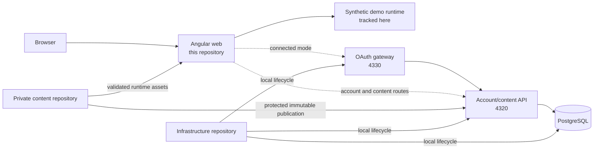
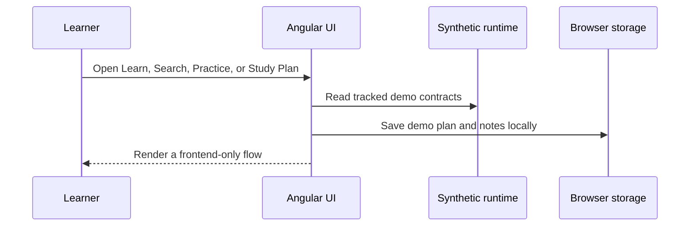
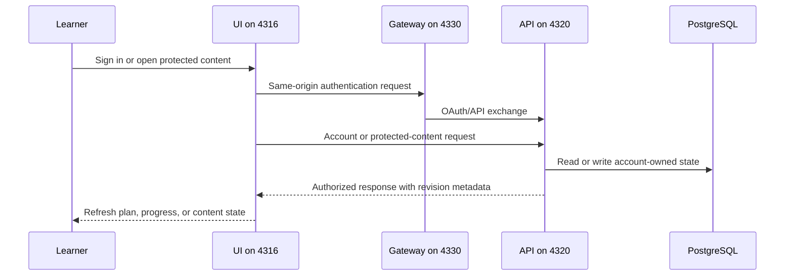

# Look Ahead Learning Web

Angular frontend for a technical learning platform organized into three connected
paths: **Learn**, **Grow**, and **Look Ahead**.

This is a portfolio-safe public source repository. It contains the application,
content contracts, shared learning components, tests, and deliberately synthetic
demo content. Proprietary curriculum, rankings, complete ready-made schedules,
delivery evidence, credentials, and learner data are kept outside this Git history.

## Platform highlights

- Learn foundations, Grow production practice, and Look Ahead architecture,
  leadership, and engineering judgment.
- Unified Search, lessons, interview questions, hands-on practice, guided
  algorithm traces, and adaptive Study Plans.
- A private catalog with 730 ranked canonical DSA problems and 450 validated
  ready-made Study Plan templates. This repository includes only safe examples
  of the same versioned contracts.
- Shared Harbor Signal light/dark presentation, responsive layouts, keyboard
  navigation, and semantic interaction states.
- A frontend-only public demonstration and an optional connected local mode with
  account-owned plans, PostgreSQL, OAuth, and protected content.

## Architecture



Route-level pages are lazy-loaded. Content services translate versioned JSON
contracts into view models; reusable components own recurring learning behavior.
Pages must not infer authorization or repair invalid private content.

## Repository relationships

| Repository | Responsibility | Independent local use |
| --- | --- | --- |
| **`lookahead-learning-web-public`** | Angular product, public demo, UI contracts, accessibility and browser integration | Runs with tracked synthetic content; no service required |
| **`lookahead-learning-api`** | Authentication, authorization, protected reads, plans, progress and recovery | Runs with its synthetic fixtures; PostgreSQL is needed only for account mode |
| **`lookahead-learning-infra`** | Local PostgreSQL/API/gateway/mail orchestration and future AWS definitions | Runs infrastructure tests and standalone PostgreSQL; integrated mode uses the API checkout |
| **`lookahead-learning-content`** | Private curriculum, ranking, Study Plan templates, publication tools and evidence | Runs private validation; must remain private |

The public web and API demonstrations never require the private repository.
Private review builds copy only validated runtime assets into an ignored staging
directory; those files must never be committed here.

## Learner flows

Public demo:



Connected local mode:



## Run locally: public demo

Requirements: Node.js24 and npm11 or newer.

```shell
npm ci
npm start
```

Open http://localhost:4300. This mode always uses `demo-content/runtime`, even
when a private sibling checkout exists. It needs no API, database, Docker,
credentials, or private content. Plans and notes stay in this browser.

Useful routes:

| Route | Experience |
| --- | --- |
| `/` | Landing and platform overview |
| `/learn` | Foundation catalog |
| `/grow` | Production-practice catalog |
| `/look-ahead` | Architecture and leadership catalog |
| `/search` | Unified topic and learning-mode discovery |
| `/learn/hands-on-dsa` | Ranked DSA practice catalog |
| `/study-plan` | Study Plan creation, review and progress |
| `/sign-in`, `/sign-up`, `/account` | Account entry and profile surfaces |
| `/support` | Support and feedback surface |

Choose another free port when needed:

```shell
npm start -- --host 127.0.0.1 --port 4317
```

## Run locally: private browser-only review

Keep `lookahead-learning-content` beside this repository, then run:

```shell
npm run start:private -- --configuration demo --host 127.0.0.1 --port 4318
```

The application copies private `runtime/` content into ignored local staging.
It still uses browser-local plan state and makes no account persistence claim.

## Run locally: connected platform

Use the sibling infrastructure repository to start the named PostgreSQL, API,
mail, and OAuth gateway services. Then run:

```shell
npm ci
npm run start:connected -- --host 127.0.0.1 --port 4316
```

Open http://127.0.0.1:4316. Checked-in proxy contracts send authentication routes
through gateway4330 and account/protected-content routes to API4320. Private
content appears only after an authorized immutable publication has been prepared
and mounted by the local infrastructure workflow.

See `lookahead-learning-infra/docs/local-accounts.md` and
`lookahead-learning-infra/docs/oauth-local.md` for service startup and shutdown.
Do not start a second stack for a frontend-only styling change.

### Isolated local delivery editor

Use `start:private` when the author Delivery Plan needs its local editor. Plain
`ng serve` does not provide `/__local/delivery` and can show Plan unavailable.
`LOOKAHEAD_BASE_PROXY_CONFIG` selects a JSON base proxy before the startup script
adds its token-protected local editor route. Targets must be HTTP loopback
services; the selected file cannot override `/__local` or dynamic proxy routing.
Omitting the variable preserves the checked-in `proxy.conf.json` defaults.

For a working UI on4301 connected to the isolated4321/4331 development stack:

```sh
LOOKAHEAD_CONTENT_ROOT=/absolute/path/to/private-content/runtime \
LOOKAHEAD_BASE_PROXY_CONFIG=/absolute/path/to/infra/environments/local/proxy.development.json \
npm run start:private -- --configuration protected --host 127.0.0.1 --port 4301
```

The content root stays outside the public repository. Generated content and proxy
files are ignored; the proxy carrying the local editor token is owner-readable
only and removed on shutdown. Keep other running UI instances on their own ports.
Delivery Plan is guarded by the server-provided author capability, including its
legacy `/delivery` redirect, and is absent from the public landing footer.

### Local author previews

The account menu exposes **Author previews**, **Delivery plan**, and **Architecture**
only when the authenticated account has the server-provided `authorPreview`
capability. `/author/previews` and `/author/architecture` use the same author guard.

The protected environment sets `authorPreviewsBaseUrl` to `/bff/author/previews/`;
the default, demo, and public production environments leave it empty. An empty
configuration shows an unavailable state and makes no inventory request.
Use the connected stack's existing `/bff/**` proxy to its OAuth gateway. The
working development stack uses gateway4331; select its matching proxy JSON when
starting the UI. Do not add a direct static-server proxy or start the preview
service from the UI.

The page reads `preview-directory/manifest.json` under the configured mount. It
expects `schemaVersion: "author-previews/v1"`, `urlBase: "manifest-directory"`,
and entries with `id`, `group`, `title`, `status`, `note`, `available`,
and `links` (`label`, `href`, optional `theme`). Relative links resolve against
the manifest URL. A single-leading-slash link refers to the private tree root
and is rebased under the configured mount; already-prefixed links are preserved.
Every resolved link must stay inside that mount. Preserve the whole
preview tree so sibling assets and query strings continue to work. Private HTML,
the inventory, and curriculum are never copied into the public application.

The gateway contract checks the authenticated server author capability and current
trusted catalog grants for each manifest and asset request. It returns 401 when
signed out and 403 for a learner. The Angular guard controls page navigation;
the gateway owns authorization for the actual files. Public production builds
leave this configuration empty. Service failures and incompatible inventories
show an explicit retry state. The account-menu Architecture link opens the canonical
document directly; its existing tabs provide the data model and end-to-end views.

The collections contract supplies explicit `order`, `featuredEntryId` and
`historyEntryIds`. The page displays one featured card per collection, in curated
review order, and compact collapsed links for earlier versions and alternatives.
Featuring a preview does not imply selection or approval. Search also matches
history entries and expands matching collections so those links can be found.

## Main source areas

```text
src/app/
├── content/     versioned contracts, adapters, Search and Study Plan logic
├── core/        shared header, reader, debugger, practice and tutor components
└── pages/       lazy route-level product surfaces

demo-content/runtime/   tracked redistributable demonstration data
scripts/                publication, validation, profiling and local-start tools
docs/                   public architecture and source-boundary documentation
```

Shared interaction colors use Harbor Signal teal for primary actions and the
established blue for links. Learn, Grow, and Look Ahead identity colors are small
labels or structural markers; they do not recolor generic actions.

## Verification

For a frontend-only change, run affected unit/component checks, a build, and a
targeted browser check. A changed auth, API, persistence, sync, or recovery
boundary also needs the relevant API and cross-service checks.

Complete public verification:

```shell
npm run validate:source-boundary
npm run validate:public-readiness
npm run validate:content
npm run validate:content:ci
npm test -- --watch=false
npm run build
```

Private content verification uses `npm run validate:content:private` and
`npm run build:private` with an authorized sibling content checkout.

See [Architecture](docs/architecture.md),
[Content Boundary](docs/content-boundary.md), and the
[Public Repository Runbook](docs/public-repository-runbook.md).

## Current limits

- The public fixture is intentionally small and does not represent the private
  curriculum.
- Browser-only plans do not synchronize across devices.
- Connected OAuth/PostgreSQL is local development, not production certification.
- Learner code execution is deferred; dormant candidate code is not a learner
  capability.
- AWS deployment, billing, and live AI-provider integration remain separate work.

## Repository status

No open-source license has been selected. Public visibility does not grant reuse
or redistribution rights.
