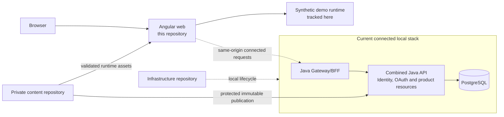
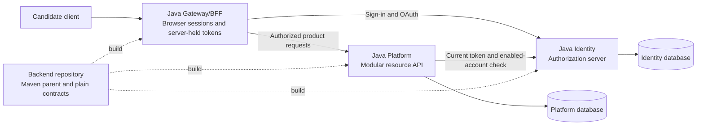
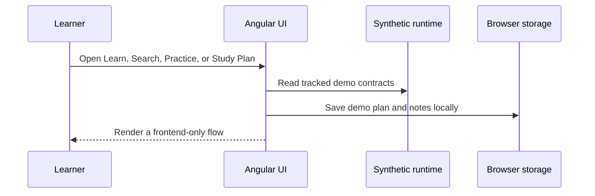

# Look Ahead Learning Web

Angular frontend for a technical learning platform organized into three connected
paths: **Learn**, **Grow**, and **Look Ahead**.

This is a portfolio-safe public source repository. It contains the application,
content contracts, shared learning components, tests, and deliberately synthetic
demo content. Proprietary curriculum, rankings, complete ready-made schedules,
delivery evidence, credentials, and learner data are kept outside this Git history.

## Page sidebars

The shared page shell builds an outline from visible sections and exposes already-loaded
recall/practice when available. Learn, Grow and Look Ahead catalogs also show the shared learning prompt in the right sidebar before a lesson is opened.
At desktop widths (1100px and above), the reader reserves 248–360px on each side, adapting to viewport width, for navigation and recall. Both panels open by default and toggle independently without covering the content.
On smaller screens, both sections start open in normal flow above the reader. Their labeled heading buttons remain visible when contents are collapsed. Sections toggle independently, and resizing preserves the learner’s choices. The homepage outline stays visible without a toggle: it occupies the left gutter on desktop and becomes a horizontally scrollable row below the header on narrow screens.
Both sidebar statements remain visible when their navigation/practice bodies are collapsed; when gutters are too small, they move into normal flow after the page instead of crowding the reader. The docked left navigation and selected row fade toward the content; the docked right sidebar is borderless and transparent. No backdrop, page lock, or focus trap is introduced. Header and breadcrumb navigation
remain available. The homepage has only a left outline and retains its signature in the
hero. Coding Problem Workspace is excluded; author pages retain their existing layout.
Section highlighting tracks the reading area below sticky lesson tools. Both docked panels use matching outer insets for equal content gaps.
Sidebar state is transient and adds no API or saved-session contract.

## Header course navigation

The Learn dropdown places Engineering Tools before Computer Fundamentals so the six-column desktop menu has a shorter second row. This presentation order does not change the catalog’s learning order.

The shared `PlatformBrand` component renders the LookAhead symbol and wordmark
in the platform header and restricted sign-in header. The title uses clean
LookAhead lettering: Look in the text color and Ahead in the theme accent.
The working header symbol uses two eyes beside a blue L-shaped wall. A thicker
right stroke of the apricot A contains a subtle I-shaped opening. Violet code
brackets frame A and distinguish code from the letter in both themes; one arrow
follows the wall's top edge, curves around it, and reaches the closing bracket. Identity tokens in `src/styles.css`
preserve these groups. The mobile header scales the icon and title;
forced-color modes retain the text name. The home link keeps its accessible
name and keyboard focus. `public/favicon.svg` uses the same standalone symbol.

The homepage also displays the illustrated title in a static closing section
after Keep exploring and before the footer. “Our platform” introduces the heading
“The Essence of Look Ahead”; the page sidebar calls it “The essence” to distinguish
the platform story from the Look Ahead catalog. `PlatformBrandIllustration` keeps
that artwork separate from navigation branding, scales without cropping, and
uses the shared identity colors. The heading and caption provide real text;
decorative SVG shapes are hidden from assistive technology. The illustration's
aspect ratio reserves its layout space, and forced-color mode retains the text.
The illustrated E uses circuit terminals for Explore and Engineering; the final A
combines a structural frame with a three-node branch for Algorithms and Architecture.
The closing statement connects those themes to learning and engineering growth,
followed by “Understand the obstacle. Find the way.” and “Understand the invariant.
Practice the reasoning.” The compact logo sits between them on desktop; they
stack with the logo between them at narrow widths.
The illustration's continuous arrow now curves around the top of its wall as well.
The statement uses the header's local Avenir Next font stack for display lines,
system text for supporting copy, shared theme colors for emphasis, and deliberate
line groups that can wrap naturally on small screens. No web fonts are downloaded.

Learn, Grow and Look Ahead open compact course directories. Course links open their
canonical route on the first click or tap; they do not expand a Course Highlights
panel or request per-course highlights. Keyboard users expand a path with Down
Arrow or Space and activate a course with Enter. Escape closes the directory and
returns focus to its path link. Modified clicks retain native link behavior.

## Platform highlights

The landing carousel uses labeled slide selectors and previous/next/play controls,
without a separate slide-name caption, reading prompt, or duplicate status paragraph.

Foundation lessons may provide an optional `beginnerGuide` (Learn) or
`teachingGuide` (Grow and Look Ahead) within the existing
`foundation-lesson/v1` contract. The shared reader starts with prerequisites,
a complete example, explained steps, a small exercise and takeaways. The exercise answer uses a native disclosure; the complete lesson follows
inline without an expansion step.
The guide supplies the article outline and sidebar recall. Grow uses practical
verification exercises; Look Ahead uses decision exercises. Scenarios render as
wrapped text, while Learn code examples remain copyable. Introductory sections share the full lesson’s typography, section surfaces, and
responsive padding, with aligned content edges. The outline includes both introductory and full-lesson sections. Detailed material and
practice stay visible in the same reading flow. Code and scenario examples sit on the left on wide screens; explanations flow beside them and continue below to use available space. At narrow widths the reader stacks them in source order. Walkthroughs and explicit multiple points inside explanation cards use semantic bullet lists, preserving headings and single prose explanations. Unguided foundation lessons put concrete sections before
the abstract model. There is no learner execution service. Proprietary guide
content belongs in the private Content repo.

- Learn foundations, Grow production practice, and Look Ahead architecture,
  leadership, and engineering judgment.
- Unified Search with an optional selected-result preview, lessons, interview
  questions, hands-on practice, guided algorithm traces, and adaptive Study Plans.
- A private catalog with 730 ranked canonical DSA problems and 450 validated
  ready-made Study Plan templates. This repository includes only safe examples
  of the same versioned contracts.
- Shared Harbor Light / Midnight & Apricot Dark presentation, responsive layouts, keyboard
  navigation, and semantic interaction states.
- A frontend-only public demonstration and an optional connected local mode with
  account-owned plans, PostgreSQL, OAuth, and protected content.

## Architecture

The current connected local stack uses a separate Java/Spring Gateway process
and a combined Java/Spring API containing both authorization-server and product
responsibilities. A separate candidate splits these into three Java/Spring Boot
applications and two independently owned databases. The candidate has not
replaced the current stack or migrated its data.


```mermaid
flowchart LR
  Browser[Browser] --> Web["Angular web<br/>this repository"]
  Web --> Demo["Synthetic demo runtime<br/>tracked here"]
  subgraph Current["Current connected local stack"]
    Gateway["Java Gateway/BFF"] --> API["Combined Java API<br/>Identity, OAuth and product resources"]
    API --> DB[(PostgreSQL)]
  end
  Web -. same-origin connected requests .-> Gateway
  Content["Private content repository"] -->|validated runtime assets| Web
  Content -->|protected immutable publication| API
  Infra[Infrastructure repository] -. local lifecycle .-> Current
```


```mermaid
flowchart LR
  Client["Candidate client"] --> Gateway["Java Gateway/BFF<br/>Browser sessions and server-held tokens"]
  Gateway -->|Sign-in and OAuth| Identity["Java Identity<br/>Authorization server"]
  Gateway -->|Authorized product requests| Platform["Java Platform<br/>Modular resource API"]
  Platform -->|Current token and enabled-account check| Identity
  Identity --> IdentityDB[(Identity database)]
  Platform --> PlatformDB[(Platform database)]
  Build["Backend repository<br/>Maven parent and plain contracts"] -. build .-> Gateway
  Build -. build .-> Identity
  Build -. build .-> Platform
```

The candidate Gateway has no database credentials. Identity owns credentials,
OAuth state and signing keys; Platform owns product permissions, protected
content, plans, progress and support state. Plan/version/activity/receipt writes
remain one Platform transaction. Backend supplies shared build tooling and
transport contracts; it is not another running application.

Route-level pages are lazy-loaded. Content services translate versioned JSON
contracts into view models; reusable components own recurring learning behavior.
Pages must not infer authorization or repair invalid private content.

## Repository relationships

| Local repository folder             | Source boundary                                         | Responsibility                                                                                                 |
| ----------------------------------- | ------------------------------------------------------- | -------------------------------------------------------------------------------------------------------------- |
| **`lookahead-learning-web-public`** | Public web source (`lookahead-learning-web`)            | Angular product, synthetic standalone demo, UI contracts and browser integration                               |
| **`lookahead-learning-api`**        | Public compatibility baseline (`lookahead-content-api`) | Current combined Spring API and separately launched Gateway profile, existing schemas and migrations           |
| **`lookahead-learning-gateway`**    | Private candidate                                       | Browser sessions, server-held OAuth tokens and fixed Identity/Platform routing                                 |
| **`lookahead-learning-identity`**   | Private candidate                                       | Credentials, enabled identities, OAuth clients/authorizations, signing keys and Identity database migrations   |
| **`lookahead-learning-platform`**   | Private candidate                                       | Product capabilities/grants, plans/progress, protected content, support state and Platform database migrations |
| **`lookahead-learning-backend`**    | Private shared build                                    | Maven parent, plain transport contracts, application image build and verification tooling                      |
| **`lookahead-learning-infra`**      | Private infrastructure                                  | Local lifecycle, separate database roles, Compose, environment configuration and deferred AWS definitions      |
| **`lookahead-learning-content`**    | Private content                                         | Curriculum, rankings, Study Plan templates, publication tools, private architecture previews and evidence      |

The four candidate application/build repositories are sibling checkouts with
these exact folder names. Their Maven build resolves local sibling sources;
reproducible builds need compatible revisions of all four. Candidate startup and
database provisioning belong to Infra. Existing-state migration, rollback,
production hosting and a live cutover remain separate work.

The public web and API demonstrations never require the private repository.
Private review builds copy only validated runtime assets into an ignored staging
directory; those files must never be committed here.

Node-based frontend and author/delivery handlers, the key-protected Python preview
source, SMTP capture and lifecycle/probe scripts are local development and
verification tools. They are separate from the Java/Spring product applications.
They do not define production hosting or activate learner code execution.

## Learner flows

Public demo:


```mermaid
sequenceDiagram
  participant L as Learner
  participant W as Angular UI
  participant D as Synthetic runtime
  participant B as Browser storage
  L->>W: Open Learn, Search, Practice, or Study Plan
  W->>D: Read tracked demo contracts
  W->>B: Save demo plan and notes locally
  W-->>L: Render a frontend-only flow
```

Current connected OAuth mode:

```mermaid
sequenceDiagram
  participant L as Learner
  participant W as Angular UI
  participant G as Gateway/BFF
  participant A as Combined API and authorization server
  participant P as PostgreSQL
  L->>W: Sign in or open protected content
  W->>G: Same-origin authentication request
  G->>A: OAuth/API exchange
  W->>G: Same-origin account or protected-content request
  G->>A: Server-held access token
  A->>P: Read or write account-owned state
  A-->>G: Authorized response with revision metadata
  G-->>W: Browser response; tokens remain server-side
  W-->>L: Refresh plan, progress, or content state
```

## Run locally: public demo

Requirements: Node.js 24 and the exact npm version declared in `packageManager`
(currently npm 11.17.0). The Angular packages use the patched 22.2 family;
the lockfile resolves Angular 22.2.1 and Piscina 5.3.2. After dependency updates,
run `npm ci`, `npm run security:dependencies`, and `npm run test:security-gates`
before frontend tests and builds.

Unit tests isolate each file so component overrides and browser mocks cannot leak
into another suite. `npm run test:order` runs the same assertions in a shuffled
order with one worker (seed 1106), to check fixture and mock cleanup within files.

Authored HTML used in plain-text lesson labels, pattern names and problem prompts
passes through `src/app/core/html-text.ts`. It parses a detached document, removes
script/style/template content and decodes entities once. Its output belongs only
in text bindings; it is not an HTML sanitizer. Run its regression tests together
with the affected lesson, pattern and question component tests after changes.

```shell
npm ci
npm start
```

Open http://localhost:4300. This mode always uses `demo-content/runtime`, even
when a private sibling checkout exists. It needs no API, database, Docker,
credentials, or private content. Plans and notes stay in this browser.

Useful routes:

| Route                              | Experience                                                               |
| ---------------------------------- | ------------------------------------------------------------------------ |
| `/`                                | Landing and platform overview                                            |
| `/learn`                           | Foundation catalog                                                       |
| `/grow`                            | Production-practice catalog                                              |
| `/look-ahead`                      | Architecture and leadership catalog                                      |
| `/search`                          | Unified topic and learning-mode discovery with optional result summaries |
| `/learn/hands-on-dsa`              | Ranked DSA practice catalog                                              |
| `/study-plan`                      | Study Plan creation, review and progress                                 |
| `/sign-in`, `/sign-up`, `/account` | Account entry and profile surfaces                                       |
| `/support`                         | Support and feedback surface                                             |

The three Learn, Grow, and Look Ahead cards on `/` are full-area native links to
their catalog routes, including keyboard focus and normal browser new-tab actions.

The approved DLV-801 Search refinement uses compact, full-title result rows.
Results occupy the full desktop width until a row is selected through its native
button. Selection opens a companion beside the list and presents that result in
a separate sticky slot above the remaining rows. A visible Close preview control
returns to the full-width list. Sticky positions follow the measured Search
controls, keeping the companion title and action visible during desktop scroll.
The remaining rows retain their rank and group order, and closing the preview
restores the original list. At
800 CSS pixels and below, one preview opens directly beneath its row without
moving the row. Short desktop viewports use normal flow instead of sticky pinning.
Path, course and difficulty links remain separate controls. Hover, keyboard
focus and persistent selection have distinct visible states; the page uses
normal document scrolling without a mobile dialog or duplicate answer tree.
Result rows omit a synopsis when it only repeats the displayed title.

The selected result is shareable as `previewItem` in the Search URL. Selection
replaces the current history entry; reload and Back/Forward navigation restore
valid URL context without a new history entry per click. A new query clears the
selection, while sorting, grouping and loading more preserve it when valid.
Filters clear an excluded selection. The Filters popover closes on an outside
click or Escape; Escape returns focus to its summary. The preview shows a full
title, an existing indexed summary where
available, one canonical full-content action and a Details disclosure with
course, module, difficulty, available languages and actionable subject filters.
Missing preview content is described honestly. Empty Languages metadata is
omitted; `language=unspecified` remains a usable Search filter. Premium is
passive metadata, not an access grant. Explain-format interview questions load
only the canonical short `interviewAnswer` through the existing access-checked
route; **Read full answer** opens the complete question. Previewing makes no
account, Study Plan or progress write.

The approved heading, exact result counts, learning modes, filters, query
precedence and canonical routes remain in place. The local integrated preview
is development behavior and does not claim production deployment or a new API
contract.

Choose another free port when needed:

```shell
npm start -- --host 127.0.0.1 --port 4317
```

## Run locally: private browser-only review

Keep `lookahead-learning-content` beside this repository, then run:

```shell
npm run start:private -- --configuration demo --host 127.0.0.1 --port 4318
```

The application copies private `runtime/` content into ignored local staging.
It still uses browser-local plan state and makes no account persistence claim.

## Run locally: connected platform

Use the sibling infrastructure repository to start the named PostgreSQL, API,
mail, and OAuth gateway services. Then run:

```shell
npm ci
npm run start:connected -- --host 127.0.0.1 --port 4316
```

Open http://127.0.0.1:4316. Checked-in proxy contracts send `/bff/**`, `/content/**`
and OAuth client callback routes through gateway4330. `/api/**` and
authorization-server routes target the combined API on4320. The connected OAuth
account flow uses the BFF so access tokens stay server-side. Private
content appears only after an authorized immutable publication has been prepared
and mounted by the local infrastructure workflow.

See `lookahead-learning-infra/docs/local-accounts.md` and
`lookahead-learning-infra/docs/oauth-local.md` for service startup and shutdown.
Do not start a second stack for a frontend-only styling change.

### Custom Study Plan builder

Open `/study-plan?create=1` to build a custom plan through five progressive
steps: setup, Learn, Grow, Look Ahead, and review. Setup must be valid before the
course steps open; each path may be left empty as long as at least one accessible
course is selected across the whole plan. The current step is URL-owned for
Back/Forward navigation, while unsaved choices use session-scoped draft intent so
a reload or sign-in continuation does not create a saved plan. The final Review
step summarizes the setup and all three paths before generating the existing
temporary schedule. Save remains an explicit action inside that schedule review.

Course choices use a three-column desktop grid, two columns on tablet and one on
narrow mobile. Ready-made plans keep their separate picker and adoption guard;
the custom builder does not impose ready-made foundation policy on learner-selected
plans.

### Active Study Plan

Open `/study-plan?plan=<id>` to continue a saved account plan. The page uses
**Study Plan** as its learner-facing title, presents the saved goal as the tagline,
and keeps duration, recovery, saved state and plan actions together near the page
heading. The same active-plan card continues into the always-visible
**Protect the time you have.** first-week allocation above the activity desk.
Beside the time summary, a compact 2×2 editorial grid presents four page-description
statements: browsing follows saved progress without moving it, completion records
practice rather than mastery, progress belongs to this plan, and Learn/Practice/Recall
fit within the learner's chosen time. Account mode identifies the saved account;
browser-local mode identifies the current browser honestly.
**Topics in your plan** and its stateful Hide/Show control
share the left rail. Browse a topic,
activity, or recall without changing progress. The former standalone next-activity
and Resume strip is removed; the underlying eligible daily queue and recorded
study-day selection remain the source of recommendations. No separate reading
bookmark is persisted. Returning from a contextual reader restores the viewed
activity independently of that recommendation.

The selected study day renders its actual scheduled activities as responsive
cards. Each card carries the canonical Open action, its explicit progress control,
and the item's complete scheduled strategy sequence. Understand, Practice and
Recall occurrences are clickable compact controls that move to the occurrence's
real study day without recording progress.

The former **Plan overview and time allocation** and **Daily schedule and
adjustments** disclosure sections are removed from the active view. Their useful
entry points remain in the heading-level plan actions and the visible allocation
summary, avoiding a second copy of the day activities below the card grid.

Progress changes only through explicit completion, attempt, review-note, or
recovery controls. Every available activity has a content-aware link to its
canonical lesson, question, or problem; opening content never records completion.
Completion can be undone where the existing activity contract supports it. The
complete schedule, daily adjustments, revision history, source pins and access
checks remain available. No learner-code execution is enabled.
Connected mode uses the existing account activity API; the standalone demo saves
only in the current browser and does not synchronize across devices.

### Manage account

The account page groups Profile, Security, Active sign-ins, and Learning summary
into separate panels. At narrow widths the panels stack with space between them;
their existing profile, password, session, and saved-plan actions are unchanged.

Open **Manage account** from the signed-in account menu to review your profile,
edit your display name, or change your password. Password changes require your
current password and sign you out of every supported session after confirmation.
The signed-in account view uses a full page layout with responsive account sections;
the sign-in and sign-up forms remain compact. Authentication pages omit the
redundant header Sign in link while session restoration is in progress.

The read-only **Learning summary** lists the account's saved study plans using
the already-loaded account API data. Each plan links to `/study-plan?plan=<id>`.
Session progress is displayed only when the API supplies available, valid counts;
missing metadata is not treated as zero progress. Duration, daily time and the
last-updated date are shown when supplied. Loading and failed requests remain
distinct from an account with no saved plans. The current plan-card contract has
no lifecycle status, so this view does not infer an active plan from dates.

**Continue learning**, **Study Plan**, and **Search** are native navigation links
styled as actions. Continue learning preserves its validated return route,
including query parameters and fragments; identical destinations are not repeated
within the action group. Viewing this page does not create, select, or modify a plan.
These account features require connected mode; the standalone public demo retains
its browser-local behavior.

### Active sign-ins (connected Identity contract)

Manage account includes an authoritative inventory of active logical sign-ins.
Local development has no admission cap; DEV and PROD permit at most two. Tabs
sharing one browser session count once; another browser profile or private session
generally counts separately. Browser/device descriptions are
approximate. The current sign-in can have an optional label. Individual Sign out
and Sign out other sign-ins require explicit confirmation and preserve saved work.
Changing a password retains the stronger behavior of ending every sign-in.

Refresh list restores focus to its control after loading or failure and announces
the result. The Local count uses singular or plural text, and current-session
confirmation describes the actual number of other active sign-ins.

This slice requires the DLV-920 Identity/Gateway contract. It uses the same-origin
Identity routes under `/api/v1/account/sign-ins` and does not derive authorization
from client labels or identifiers. A recent-authentication rejection preserves the
current account and draft. Confirming the current password uses the existing login
flow; the learner must then explicitly resubmit the requested change.

A third successful password proof in DEV or PROD returns `SIGN_IN_LIMIT`. The frontend opens the
restricted `/sign-in/choose` page, which has no learner navigation or account-data
initialization. The learner selects a sign-in to end or cancels. Only acknowledged
replacement proceeds through the normal OAuth/BFF continuation. Cancel returns to
sign-in while keeping existing sign-ins, and validated return URLs reject external
or sign-in-loop destinations. Expired challenges require a fresh sign-in. A failed
or lost response is not presented as successful admission or revocation.

Frontend tests exercise these contract responses with synthetic data. A disposable
Local integration check also verified third-sign-in cancellation/replacement,
current and other-session revocation, label updates and unrelated-account
continuity through the browser and independent HTTP clients. Admission concurrency,
token/code revocation and service recovery remain service-owned protocol gates.
This is Local development verification, not production or native-zoom certification.

### Isolated local delivery editor

Use `start:private` when the author Delivery Plan needs its local editor. Plain
`ng serve` does not provide `/__local/delivery` and can show Plan unavailable.
`LOOKAHEAD_BASE_PROXY_CONFIG` selects a JSON base proxy before the startup script
adds its token-protected local editor route. Targets must be HTTP loopback
services; the selected file cannot override `/__local` or dynamic proxy routing.
Omitting the variable preserves the checked-in `proxy.conf.json` defaults.

For the protected working UI on4301 connected to Gateway4350:

```sh
LOOKAHEAD_CONTENT_ROOT=/absolute/path/to/private-content/runtime \
LOOKAHEAD_BASE_PROXY_CONFIG=/absolute/path/to/infra/environments/local/proxy.development.json \
npm run start:private -- --configuration protected --host 127.0.0.1 --port 4301
```

The content root stays outside the public repository. Generated content and proxy
files are ignored; the proxy carrying the local editor token is owner-readable
only and removed on shutdown. On protected4301, each editor request also checks
the current server-held author capability through Gateway4350; the local token
alone does not grant browser access. Keep other running UI instances on their own ports.
Delivery Plan is guarded by the server-provided author capability, including its
legacy `/delivery` redirect, and is absent from the public landing footer.

### Local author previews

For an account with the server-provided `authorPreview` capability, the Author
portion of the account menu has **Author Previews**, **Delivery Plan**, and a
**Documentation** disclosure. It reveals direct links to Architecture, Local
setup & development, API reference and Operations. The shared Author sidebar
uses the same order and grouping. Documentation opens by default on one of its
four routes and can be collapsed; it starts closed on other Author routes. The
existing `/author` route remains available by direct URL, while every Author
destination retains its author guard.

The protected environment sets `authorPreviewsBaseUrl` to `/bff/author/previews/`;
the default, demo, and public production environments leave it empty. An empty
configuration shows an unavailable state and makes no inventory request.
Use the connected stack's existing `/bff/**` proxy to its OAuth gateway. The
working development stack uses gateway4331; select its matching proxy JSON when
starting the UI. Do not add a direct static-server proxy or start the preview
service from the UI.

The page reads `preview-directory/manifest.json` under the configured mount. It
expects `schemaVersion: "author-previews/v1"`, `urlBase: "manifest-directory"`,
and entries with `id`, `group`, `title`, `status`, `note`, `available`,
and `links` (`label`, `href`, optional `theme`). Relative links resolve against
the manifest URL. A single-leading-slash link refers to the private tree root
and is rebased under the configured mount; already-prefixed links are preserved.
Every resolved link must stay inside that mount. Preserve the whole
preview tree so sibling assets and query strings continue to work. Private HTML,
the inventory, and curriculum are never copied into the public application.

The gateway contract checks the authenticated server author capability and current
trusted catalog grants for each manifest and asset request. It returns 401 when
signed out and 403 for a learner. The Angular guard controls page navigation;
the gateway owns authorization for the actual files. Public production builds
leave this configuration empty. Service failures and incompatible inventories
show an explicit retry state. The Documentation Architecture link opens the canonical
document directly; its existing tabs provide the data model and end-to-end views.
The private Architecture source also includes a Local development workflow tab;
the Author page outline keeps the protected route and selects that tab when its
section is chosen.

The collections contract supplies explicit `order`, `featuredEntryId` and
`historyEntryIds`. The page displays one featured card per collection, in curated
review order, and compact collapsed links for earlier versions and alternatives.
Featuring a preview does not imply selection or approval. Search also matches
history entries and expands matching collections so those links can be found.

Version-bound Study Plan reviews embed the protected learner-style schedule as
their primary preview. The canonical packet, decisions, and technical evidence
remain secondary actions. Review controls stay in trusted Angular outside the
sandboxed iframe; opening a preview never records a plan or review decision.

## Main source areas

```text
src/app/
├── content/     versioned contracts, adapters, Search and Study Plan logic
├── core/        shared header, reader, debugger, practice and tutor components
└── pages/       lazy route-level product surfaces

demo-content/runtime/   tracked redistributable demonstration data
scripts/                publication, validation, profiling and local-start tools
docs/                   public architecture and source-boundary documentation
```

Shared interaction colors use Harbor teal in Light and Apricot in Midnight Dark
for primary actions, with blue links in both modes. See [platform theme](docs/theme.md)
for shared tokens, semantic exceptions and verification. Learn, Grow, and Look Ahead identity colors are small
labels or structural markers; they do not recolor generic actions.

Destination cards expose their primary action over the entire card while keeping
secondary links and controls independent. See [whole-card navigation](docs/card-navigation.md)
for implementation and keyboard/pointer verification.

The platform header is sticky at its component boundary so the logo, navigation,
Search, Study Plan, theme and account controls remain at the top while reading.
Author documentation's **On this page** outline highlights the current section
as the document scrolls, separately from the current Author workspace page.
Tracking does not rewrite the URL or move keyboard focus. Embedded references
report visible heading offsets through a bounded, source-checked message exchange.

## Verification

For a frontend-only change, run affected unit/component checks, a build, and a
targeted browser check. A changed auth, API, persistence, sync, or recovery
boundary also needs the relevant API and cross-service checks.

Complete public verification:

```shell
npm run validate:source-boundary
npm run validate:public-readiness
npm run validate:content
npm run validate:content:ci
npm test -- --watch=false
npm run build
```

Private content verification uses `npm run validate:content:private` and
`npm run build:private` with an authorized sibling content checkout.

See [Architecture](docs/architecture.md),
[Content Boundary](docs/content-boundary.md), and the
[Public Repository Runbook](docs/public-repository-runbook.md).

## Current limits

- The public fixture is intentionally small and does not represent the private
  curriculum.
- Browser-only plans do not synchronize across devices.
- Hands-On DSA practice progress is saved in the current browser only, in every
  mode (including connected local mode); it does not reach an account or another device.
- Connected OAuth/PostgreSQL is local development, not production certification.
- Learner code execution is deferred; dormant candidate code is not a learner
  capability.
- AWS deployment, billing, and live AI-provider integration remain separate work.

## Repository status

No open-source license has been selected. Public visibility does not grant reuse
or redistribution rights.

## Private author review

Author Previews includes a versioned Study Plan review entry and the `/author/previews/study-plan` route. Private scope, version, evidence and decisions come from the capability-protected author-documents publication, not the public bundle. The embedded HTML uses a scripts-only sandbox; review controls belong to Angular outside the document.

The review adapter uses the BFF-protected Domain artifact registry and account-scoped review-event history. Decisions bind the canonical artifact ID, artifact version, owning ticket and source hash; the rendered HTML hash is separate display provenance. Writes use BFF CSRF and a header-only idempotency key. Decline and Need more require an explanation; comments are limited to 2,000 Unicode codepoints. Replacing a prior decision is explicit and supersedes the latest event for that account. A conflicting change requires reloading history and reviewing the new replacement target.

Uncertain submissions preserve the draft and exact retry key. A later page load reads authoritative history instead of inventing a local result. A recorded decision remains pending Main reconciliation, not ticket completion or authorization for Git changes or deployment. A disposable Local author fixture verified recording, refresh and Domain restart persistence, and a real two-tab supersession conflict. These checks supplement unit/component tests; they do not establish production durability. If publication, artifact binding or history cannot be confirmed, recording stays disabled.

## Private Operations reference

The author-only `/author/operations` and `/author/local-development` routes read protected, immutable author-documents through the Gateway. Operations covers documented topology, deployment, diagnostics and recovery. Local setup & development covers worktrees, builds, Docker, ports and verification. Neither executes commands or reports live service health. The public demo has no publication configured. The source documents remain outside this repository.

Author, Previews, Delivery Plan, Architecture, Local setup & development, API Reference and Operations use a
shared left navigation, including while the Delivery Plan is loading or unavailable. “On this page” lists headings in the current view;
Author Previews and Delivery Plan are direct links followed by an expandable Documentation
group with direct links to the four reference pages. Narrow viewports stack this navigation above the content. The
desktop sidebar stays beside the article as the page scrolls. It scrolls independently only when its links are
taller than the available viewport; narrow viewports stack it in the page flow with a bounded height.
Document outline links retain the protected Author URL and scroll the parent
page to the chosen embedded section; the raw reference remains available only
through its explicit full-page link.
Operations shows the published reference version above the document. Its
Repository and runbook links and Supporting references are regular sections in
the main reading flow with matching links in the heading outline.
The shared Operations, Local setup, API and Architecture documents report their content heights to the
parent, so their references flow with the page rather than inside a fixed-height
viewer. The Author pages use a continuous two-column reading layout; the
document frame keeps its script-only sandbox without adding a second visual page.
The working `/delivery-plan` requires an active author session. Signed-out
visitors go to sign-in and return to the plan afterward; its public JSON fallback
is intentionally unavailable on the protected working origin.

The manifest uses `schemaVersion: 1` with `documents[]`. HTML URLs must match the published document ID and content SHA-256 under `/bff/author/previews/preview-directory/author-documents/`. The iframe allows scripts for theme selection and the shared Operations height report; the parent accepts that report only from its active sandboxed frame with the expected document ID and bounded size. External references are ordinary labeled new-tab links in the Angular parent. HTTP authentication, authorization, missing publication and service failures remain distinct.

## Homepage interaction

See [homepage behavior and local verification](docs/homepage.md) for the root
route, carousel, optional public challenge, shared themes and review steps.

The learner and author sidebars share `sidebar-outline.css` for navigation row spacing, selection borders, colors and text weight. This styling does not change article width.

Sign-in, sign-up, Manage Account and sign-in selection screens exclude both shared sidebars and toggles. Their form/content layout is unchanged.

Catalog sidebars on Learn, Grow and Look Ahead expose independently expandable course groups from AdaptiveCatalog through PageSidebarContext. They reuse loaded course data and existing routes; no additional requests or persisted state.

All three catalogs use AdaptiveCatalog’s `harbor-catalog` shell: solid surface cards, equal grid columns, shared spacing and “Inside this course” topic lists. Shared rules live in `src/styles.css` and `src/app/pages/catalog-experience.css`; section anchors leave clearance below the sticky header and breadcrumb. Course and lesson refinements remain separately scoped.

Desktop catalog and lesson sidebars stop at the outer main container; its padding remains part of the content surface.

For full-viewport reader shells, sidebar bounds use the centered article gutter with 24px clearance; bounded outer containers retain their own boundary. Main content dimensions remain unchanged.

Catalog group highlighting follows its explicit heading identity independently of expansion. Desktop reader sidebars use docked presentation only with sufficient gutter space; hover underlines are distinct from the filled active-section state.

Search excludes shared sidebars and their toggles, alongside account screens and coding workspaces.

Course overviews across Learn, Grow and Look Ahead use the shared course layout without global sidebars or a separate Learn-only contents map. Catalog expandable navigation and lesson sidebars remain separate.

The two platform statements remain visible independently of sidebar navigation, including account, Search and course overview pages. Coding Problem Workspace excludes both statements; homepage uses its existing in-content statements.

PageSidebarContext supports navigation-only exclusion while retaining platform statements. The Mediator Pattern question uses this mode.

Sidebar links and group controls use a tinted hover/focus background with the shared
link color and matching underline. Selected sections retain their accent border.

Standalone platform statements use the centered reader or loading/error message
gutters. When side space is insufficient, they flow below the content with normal
word wrapping instead of becoming narrow fixed columns.

Catalog sidebar subsection/course links use a dedicated teal (light) / mint (dark) token; parent
section controls retain bold neutral text. Indentation and hover/focus cues remain.

Catalog sidebar section controls expand their course links on first activation.
Activating an expanded control collapses its courses and navigates to the matching
page heading, updating the fragment and focus with the shared header offset.
Learn shows Foundation Tracks once beneath its sidebar title; the repeated
Foundation track labels are omitted from the page sections.

Catalog sidebars highlight the path title and track label while the overview is
current. Scrolling into a group transfers the single current-location highlight
to that group; scrolling back restores the overview highlight. Learn uses
Foundation Tracks, Grow Production Capabilities, and Look Ahead Senior-readiness
Tracks. Each label appears once in the sidebar rather than above every group.

Search statement placement measures the inner search-shell gutters. Statements
remain outside the controls when docked and use normal flow when space is insufficient.

Course question reviews use a focused Search header with **Back to [module]** and
**Search all content**. Learning-map links carry the original unit ID; returning
to the course opens that unit and scrolls it into view. Question readers preserve
the filtered results URL and offer both return destinations. General Search keeps
its query form. Study Plan's curriculum retry reloads the manifest and all index
shards together, so an earlier cached publication does not trap the retry loop.

Focused course reviews also omit activity/filter and results/sort toolbars;
question cards follow the review heading directly. General Search retains those controls.

Review navigation uses underlined text links below the heading and module label,
with module return aligned left and Search all content aligned right. Links wrap
on phones and retain visible hover/focus feedback and44px minimum hit targets.

Question return links share a row with Review theory below the question panel,
with return navigation aligned left and theory aligned right. Loading/error views
keep their return links inside the centered message container.

The shared question-bank link adds a return-unit query parameter only when the
calling learning map supplies an explicit unit; lesson links retain their existing URLs.

Foundation lesson review links preserve the originating learning unit when several
lessons share a question module. Returning from scoped practice opens that unit in
the course map. Targeted regression checks cover the lesson shell, question reader,
course map, and Search (`npm test -- --watch=false` with the corresponding spec
paths); this is frontend navigation and does not change API or progress storage.

Foundation lesson details may opt into `learningFlow` with a purpose and an
independent practice prompt, hint, and explained answer. The shared reader places
the topic introduction and outcomes before examples, and keeps detailed content,
a single summary, mistakes, checks, and practice in reading order. Content without
that optional field retains the existing layout. The focused component and page
checks run with `npm test -- --watch=false --include='src/app/core/foundation-lesson-shell/*.spec.ts' --include='src/app/pages/question/*.spec.ts'`.

The shared pattern lesson reader supports optional `beginnerGuide` and
`learningFlow` metadata, matching the foundation reader's introductory sequence.
The public app contains only the rendering contract and synthetic tests; authored
curriculum stays in the external content source. Verify the reader with
`npm test -- --watch=false --include='src/app/core/pattern-lesson-shell/*.spec.ts'`.

Lesson review links preserve the containing course unit independently of the
question module. Nested lessons return to their rendered parent section in the
course map. Both lesson readers render authored practice-card emphasis through
Angular's standard HTML sanitization; they do not bypass sanitization.

Code presentation is shared with Hands-on DSA: the lesson code directive and
read-only references use the same Java/Python/Go parser and palettes, and all
`CodingSolutionTabs` practice views use `StudioEditor`. Drafts remain page-local;
this does not enable learner execution. `npm run code:presentation` builds the
ignored `/assets/code-presentation.js` bundle for embedded visual documents.
Normal build/private-start/watch paths regenerate it. Embedded documents must
load that bundle before calling `LookAheadCode.highlightLearningCode`.
The default `npm start` stages only the tracked demo in `prestart`, then builds
the shared code renderer before starting Angular. The public-readiness gate
continues to enforce the demo-only staging contract.


Lesson review navigation accepts canonical path IDs (`learn`, `grow`, and
`look-ahead`) in Search query parameters. A course/module review link retains its
focused question list, course return link and full-answer return destination.
The Search component regression suite covers the hyphenated Look Ahead path.

The curriculum-free `public/assets/visual-code-presentation.js` adapter renders
embedded illustrative code with the shared syntax bundle and an escaped-text
fallback. Its copy helper supports existing sandboxed frames through an explicit
button gesture and selection-copy fallback; iframe permissions are unchanged.


Content failures share `ContentRecovery`: authentication, access denial, planned content, missing pages and retryable failures have distinct messages. The locked preview contains only public metadata and decorative placeholders; protected bodies are never downloaded for blur. Sign-in and Manage Account preserve a validated return URL. `/author/content-access` is a capability-guarded synthetic review page linked from Author Operations. It does not change entitlements, create subscriptions, send email or enable checkout.

### Study-plan names

Creation offers an editable name independent of the learning goal. Suggested names
use `Study plan #N_DDMMYYYY_HXDays` (UTC creation date, configured daily hours,
total study days); typing a custom name replaces the whole suggestion and later
time changes preserve it. The pencil beside a saved plan name opens Save/Cancel;
Enter saves and Escape cancels. Names must be nonblank single-line text up to160
characters. Browser-only plans retain names in local storage. Connected account
plans require the Domain API `plan-name-v1` contract and migration V3; the server
allocates a per-account number and persists names across list/detail reads.

## DLV-408 lesson and story components

The shared lesson reader supports opt-in `system-v1`, `concept-v1` and
`algo-pattern-v1` presentations, including staged navigation, animated walkthroughs
and broken/fixed code comparisons. The DSA story component reads optional private
`dsa-story/v1` companions through the existing protected content flow and shares
the page language selection. Missing stories retain the existing debugger.
Card scene SVGs under `public/assets/scenes/` are presentation assets; proprietary
lesson bodies and story data remain in the private Content repository. Retired
lesson routes redirect to their current canonical destination
(`src/app/content/retired-content-ids.json`); an entry with `targetCourseId` also
moves the route to another course, as for the Java Concurrency lessons that left
Design Patterns and LLD (DLV-410). The same table sends the 74 removed AWS Cloud
question routes (`/grow/aws-cloud/aws-network-01`) to the lesson each belonged to;
`grow/:courseId/:questionId` is the only Grow route with the redirect guard. No learner code
execution service is activated.

Validate presentation contracts with `npm run test:card-contract`,
`npm run test:landing-scenes`, `npm run test:search-index`, and
`npm test -- --watch=false`; use `npm run build:protected` for the protected build.
The 2026-10-03 local Git snapshot passes those tests but exceeds the foundation
lesson component CSS build budget by 905 bytes. It is not a release certification.

Card scene SVG processing accepts only complete local fragment references for
links and CSS URLs; escaped CSS tokens are rejected. Lesson prompt extraction
and the card validator use inert DOM text parsing rather than regex tag removal.
Extracted text does not authorize HTML insertion or bypass Angular sanitation.

The foundation reader uses compact internal class names (`system`, `prose`,
`explanation`, `code-section`) in its template and styles to limit repeated
selectors in Angular's compiled CSS. Component style budgets remain enforced;
update component and global reader selectors together when renaming these classes.
The Debug-pair split diff's own grid, file bars and rows are styled in `src/styles.css`
under `app-foundation-lesson-shell .split-diff` (scoped to the reader, never Home); the
labels, prose, code blocks, tables and consoles inside it stay in the component.

## DLV-408 lesson tools, Hands-On DSA workspace and device-local practice

The practice toolbar keeps the Problem control and numbered mode tabs without repeating the problem name. The page title and full problem contract retain the name. The Problem control, mode tabs, timer and solution/visualization action share one header row when space permits, wrapping on narrow screens. Workspace buttons include brief native hover descriptions of their actions, including state-dependent Problem and solution controls. The guidance line below shows the selected mode’s instructions without a repeated Step X of Y counter.

Status (2026-10-05, extended 2026-10-06): implemented and checked locally on
`feature/DLV-408-review-notes` with component tests; captured in a local Git review snapshot, not a release
certification. All of it is
frontend behavior over the existing content contracts: no endpoint, API contract or
server-side persistence changed, and no learner code is executed.

Shared lesson components (`src/app/core/`):

- `lesson-tabs/` — underlined tabs for small groups inside a lesson (Variations,
  Common mistakes) with Previous/Next, WAI-ARIA tab keys (arrows, Home, End),
  edge chevrons when the row scrolls, and `hidden="until-found"` panels so
  in-page search still finds hidden text.
- `lesson-start/` — **Before you start**: prerequisite lessons as title-only links
  and a closed **Run it yourself** section (requirements, version notes, steps for
  IntelliJ IDEA or VS Code, project download).
- `zip/zip-store.ts` — a minimal ZIP writer (stored entries, fixed 1980 timestamp,
  so the same files give the same bytes). The project arrives as a
  `lesson-project/v1` JSON bundle through the normal content read and is packed
  into `{lessonId}.zip` in the browser.
- `pattern-map/` — the Recognize the Pattern route: units in study order with a
  signal finder that rings matching units; the rows come from the lesson's own
  section table, and narrow screens get a numbered list.
- `pattern-help/` — **Help me recognize the pattern** on a Hands-On DSA problem:
  pick a signal, see the patterns that fit and what to check first; revealing the
  problem's pattern is one more click and never changes progress. Its lesson link,
  like the concept-review links on question pages, reads "{Pattern} lesson".
- `page-sidebars/` — the lesson right sidebar: a **Practice & review** group first
  (Quick recall opens a dialog that keeps its place, hides the answer until Reveal
  and records no progress), then a **Where you are** outline (path, group, course,
  previous/current/next lesson, next course and group). The lesson column width
  does not change.
- `even-grid.ts`, `foundation-lesson-shell/console-beside.ts` and
  `platform-signature/reasoning-prompt.ts` — even card grids, a run console beside
  the explanation when it fits, and the paired corner statements.

Hands-On DSA (`src/app/pages/hands-on-dsa/`, `src/app/core/focus-studio/`):

- Catalog: hero counts from the published catalog, breadcrumb with the Learn group,
  a **Problem library** table with an inline statement preview loaded on demand,
  pattern names hidden by default, with no placeholder line under the problem title
  (`patterns=show` in the URL shows them),
  **Hide solved** (`solved=hide`), and **Surprise me**, which draws from every page
  of the current filters and prefers problems not yet solved on this device.
- Catalog views (2026-10-06): an **All problems | By pattern** switch. By pattern
  (`view=groups`, `pattern-browser.ts`) lists the patterns in preparation order on
  the left, with solved of total, and one pattern's problems on the right; below
  700px the two panes become two screens and the URL says which one. The old
  `sort=pattern-order` URL is rewritten to `view=groups`. The view and the sort are
  how the list is shown, not filters.
- Header sorting (`catalog-sort.ts`): Learning order, Problem, Difficulty and
  Interview priority headers sort both tables from one `sort` URL parameter, so an
  order carries across the views and across patterns; sorting by difficulty is off
  while the list shows one difficulty. **Status** is the last column, not sortable,
  and shows an empty circle (○) for a problem not started on this device.
- Page navigation: Hands-On DSA uses the shared sidebar default. The left navigation
  starts open when there is room to dock it beside the catalog; narrow screens keep
  the standard drawer toggle. Learners can close and reopen it.
- Workspace header and practice tools (`practice-tools.ts`,
  `studio-practice-tools.ts`): a timed attempt per problem (15, 25 or 45 minutes by
  difficulty; hints and the solution stay locked while it runs), a time/space
  prediction box directly under the editor, marked against the reference cost, and a
  keyboard shortcut line under it (1–4 tabs, P problem, H hints). Both tools use
  `sessionStorage` for the tab and never change saved progress.
- Visual walkthrough (2026-10-06, Option B "Code beside", `src/app/core/walkthrough/`):
  one player for every problem. One header row (example, language, Approach), then
  a pinned control bar (Previous, Play/Pause, Next, scrubber, Restart), the drawing,
  one caption and the values not already drawn on the left, and the reference code
  with the current line highlighted on the right; narrow screens switch between
  Drawing and Code. `core/dsa-story/` (rebuilt) and
  `focus-studio/studio-fallback-walkthrough.ts` (problems without a story) feed it.
  Its **Every line** switch steps the recorded line trace and replaces the separate
  guided debugger; `migrateStudioState` (`workspace-state.ts`) moves a saved
  debugger state from another tab to it. **Visualize solution** keeps an example the
  learner chose, and Escape (like Close visualization) returns to the tab it came
  from.
- Try it yourself: the problem's examples sit beside the editor (`studio-examples.ts`,
  input → expected with the explanation on expand). Hints start closed; the Hints
  button or H opens them above the examples.
- Recall (`studio-recall-grid.ts`, `recall-check.ts`): a two-column card grid (one
  column on phones) with a number, a coloured kind tag (from the card's optional
  `kind`; template cards without one keep their id-based tag), Reveal answer and
  Got it / Partly / Missed under a revealed answer. "N of M checked" counts graded
  cards. Open answers and grades are kept per problem in `sessionStorage` and never
  change saved progress.
- `studio-finish-review.ts` — **Finish and review** under the Recall cards at the full
  workspace width, in four columns (rating, review date of 3 days, 1 week or none,
  notes, next problems) that stack on narrow widths. Once a card is graded it
  suggests a rating and review date from the grades; only **Use this** applies it.
- `core/practice-progress/` and `practice-progress-strip.ts` — progress saved in
  this browser only under the `localStorage` key `look-ahead.dsa-practice.v1`
  (`dsa-practice-local/v1`): status, rating, review date and notes per problem.
  The strip shows solved of the published total, started and review due, counts
  only problems the catalog still publishes, and states "Saved in this browser
  only. Progress does not sync to other devices yet." When storage is blocked,
  progress lasts until the page is left. Cross-device sync is proposed, not built
  (DLV-724 in the private delivery plan).

Verify with `npm test -- --watch=false` (the specs beside each component cover the
behavior above), `npm run build`, and `node scripts/validate-content.mjs --external`
for the private content checks (including every lesson download link).

Sidebar toggles sit beside the navigation headings, below the passive corner
statements. Statement emphasis uses weight and color without underlines; the AI
review prompt reads “Review what AI writes. Know where it can fail.”

On Hands-On DSA problem pages, “Help me recognize the pattern” precedes reveal.
After reveal, the header keeps only the named pattern lesson link with its new-tab
indicator. Opening another problem conceals its pattern again; reveal changes no
saved practice progress.
